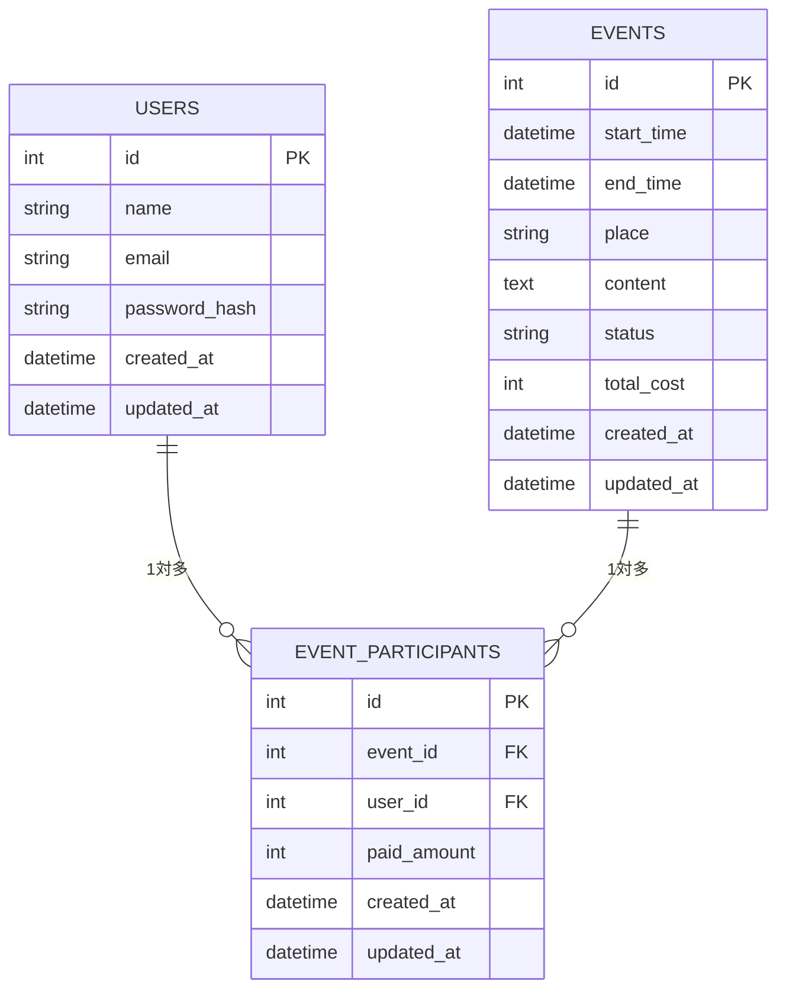

## 1. ER図

```mermaid
erDiagram

    USERS ||--o{ EVENT_PARTICIPANTS : "1対多"
    EVENTS ||--o{ EVENT_PARTICIPANTS : "1対多"

    USERS {
        int id PK
        string name
        string email
        string password_hash
        datetime created_at
        datetime updated_at
    }

    EVENTS {
        int id PK
        datetime start_time
        datetime end_time
        string place
        text content
        string status
        int total_cost
        datetime created_at
        datetime updated_at
    }

    EVENT_PARTICIPANTS {
        int id PK
        int event_id FK
        int user_id FK
        int paid_amount
        datetime created_at
        datetime updated_at
    }
```
