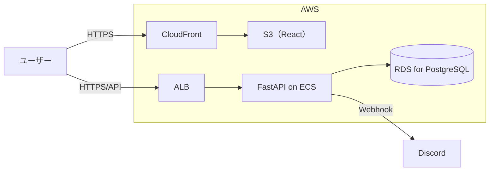

## 1. システム構成図

```mermaid
flowchart LR
    A[ユーザー] -->|HTTPS| CF[CloudFront]
    CF --> S3[S3<br>Reactホスティング]

    A -->|HTTPS/API| ALB[Application Load Balancer]
    ALB --> ECS[FastAPIコンテナ<br>on ECS/Fargate]
    ECS --> RDS[(RDS for PostgreSQL)]
    ECS -->|Webhook| DISCORD[Discord]

    subgraph AWS
        CF[CloudFront]
        S3[S3（React）]
        ALB[ALB]
        ECS[FastAPI on ECS]
        RDS[(RDS for PostgreSQL)]
    end
```
