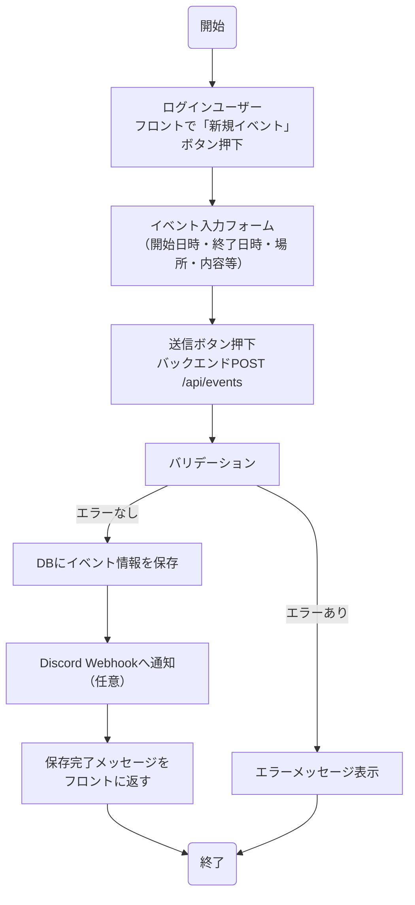

## 4. 主要ユースケースの図

### 4-1. イベントの新規作成フロー

```mermaid
flowchart TD
    A(開始) --> B[ログインユーザー<br>フロントで「新規イベント」ボタン押下]
    B --> C[イベント入力フォーム<br>（開始日時・終了日時・場所・内容等）]
    C --> D[送信ボタン押下<br>バックエンドPOST /api/events]
    D --> E[バリデーション]
    E -->|エラーなし| F[DBにイベント情報を保存]
    F --> G[Discord Webhookへ通知（任意）]
    G --> H[保存完了メッセージを<br>フロントに返す]
    E -->|エラーあり| X[エラーメッセージ表示]

    H --> Z(終了)
    X --> Z(終了)
```
